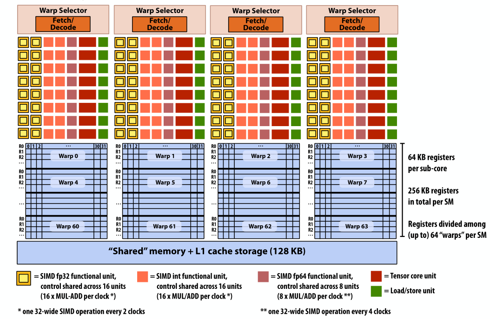
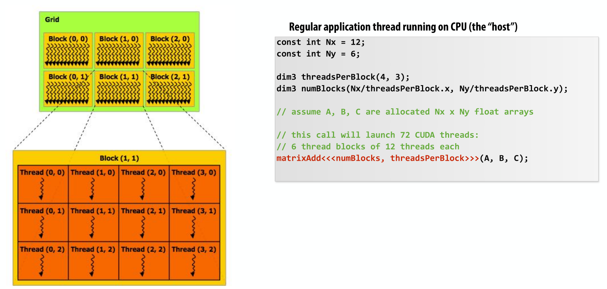

# GPU architecture
## Main framework
NVDIA V100 architecture

## Programming abstraction
To understand GPU architecture and the CUDA framework, it's essential to distinguish between **programming abstractions and the underlying GPU architecture implementation.** For example, similar to ISPC and SIMD, ISPC is an SPMD (Single Program Multiple Data) programming abstraction, while the underlying architecture uses SIMD (Single Instruction Multiple Data).

In writing a CUDA program, such as matrixAdd<<<numBlocks, threadsPerBlock>>>(A, B, C);, the programmer must specify the grid size and the number of threads within each block. The block-level programming abstraction indicates how many threads can synchronize within a block.

However, the low-level mapping of these threads is determined by the GPU architecture's Streaming Multiprocessor (SM). An SM is a collection of multiple processors but has only one instruction fetch unit. **The SM decides how to map the workload of a block onto warps (groups of 32 threads) for execution. A warp consists of 32 threads that execute the same instruction and share the same program counter.**

## Two scheduler
GPU Work scheduler vs. SM scheduler
> GPU Word scheduler assign programmer's block tasks to a certain **core.** While SM scheduler assign a block of tasks to certain **warps**.

### Concepts worth noticing

## References
* [a closer look at GPUs](https://www.researchgate.net/publication/220422248_A_closer_look_at_GPUs)
* [caltech cs179 GPU computing](http://courses.cms.caltech.edu/cs179/)
* [stanford cs149 Parallel computing](https://www.cs.cmu.edu/~15418/)
