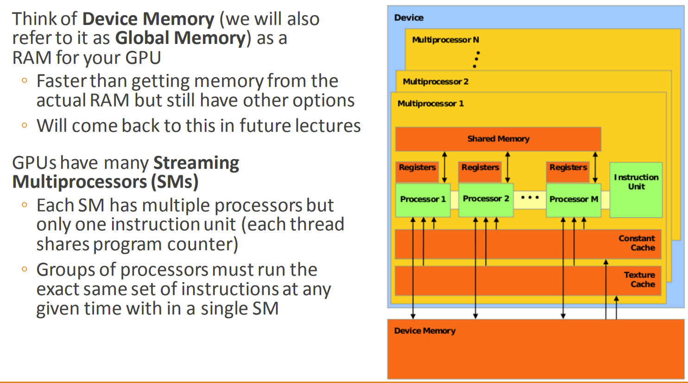
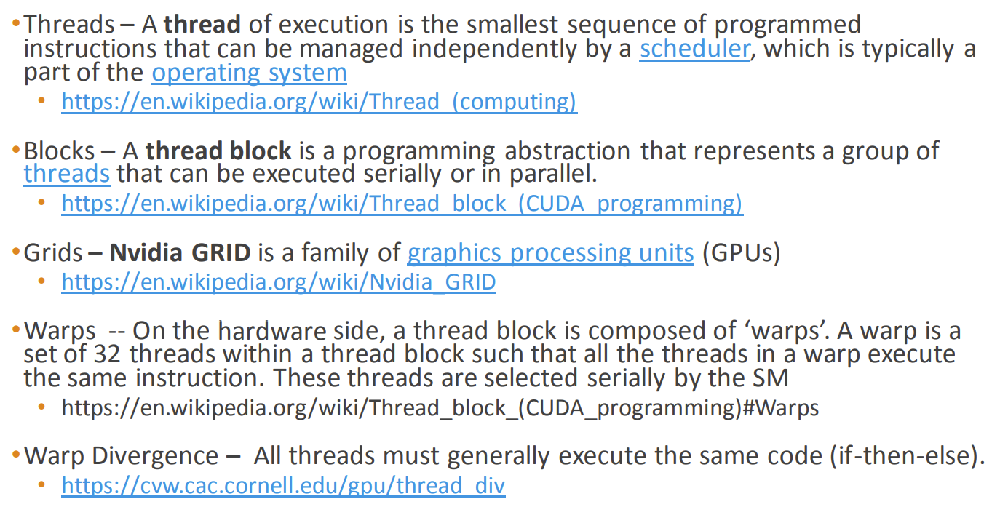
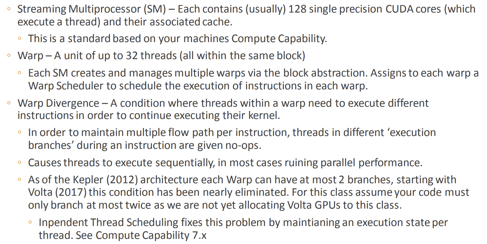

# GPU architecture
## Main framework

### Concepts worth noticing
#### SM
#### grid
#### block
#### Warp

## References
* [a closer look at GPUs](https://www.researchgate.net/publication/220422248_A_closer_look_at_GPUs)
* [caltech cs179 GPU computing](http://courses.cms.caltech.edu/cs179/)
* [stanford cs149 Parallel computing](https://www.cs.cmu.edu/~15418/)
